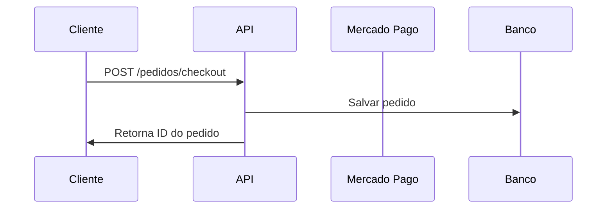
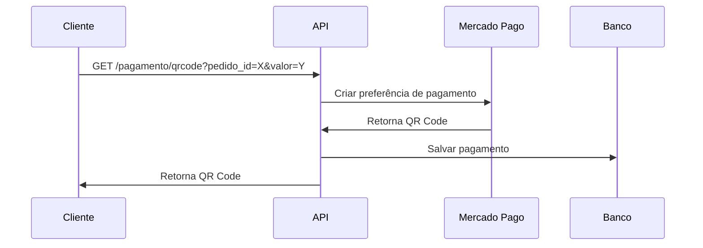
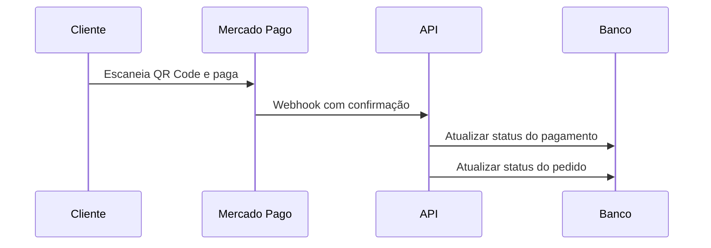
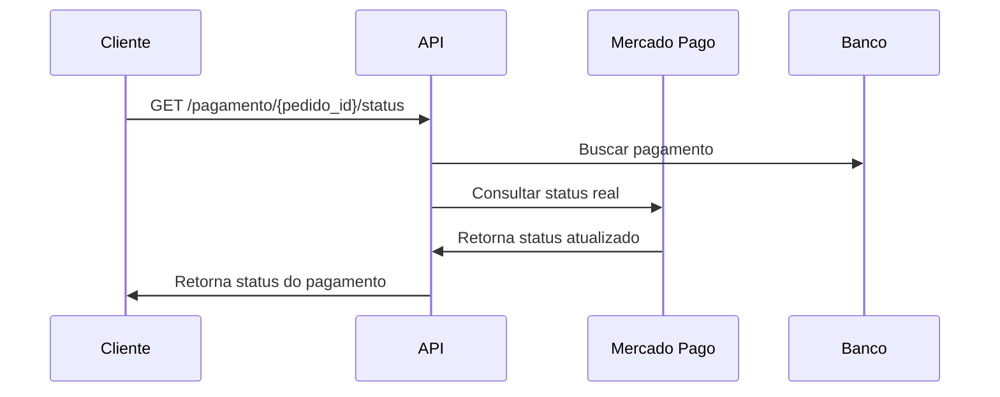

# 💳 Integração Real com Mercado Pago - Fase 2

Este documento descreve a implementação da integração **REAL** com o Mercado Pago para o sistema de autoatendimento Fast Food.

## 🔧 Configuração

### Variáveis de Ambiente

Adicione as seguintes variáveis ao seu arquivo `.env`:

```bash
# Mercado Pago Configuration
MERCADOPAGO_ACCESS_TOKEN=TEST-xxxxxxxx-xxxx-xxxx-xxxx-xxxxxxxxxxxx
MERCADOPAGO_PUBLIC_KEY=TEST-xxxxxxxx-xxxx-xxxx-xxxx-xxxxxxxxxxxx
MERCADOPAGO_WEBHOOK_URL=https://api.fastfood.com/webhook
```

### Obtenção das Credenciais

1. **Acesse o [Mercado Pago Developers](https://www.mercadopago.com.br/developers)**
2. **Crie uma conta ou faça login**
3. **Acesse suas credenciais de teste:**
   - Access Token: `TEST-xxxxxxxx-xxxx-xxxx-xxxx-xxxxxxxxxxxx`
   - Public Key: `TEST-xxxxxxxx-xxxx-xxxx-xxxx-xxxxxxxxxxxx`

## 🚀 Funcionalidades Implementadas

### 1. Geração de QR Code Real

**Endpoint:** `GET /v1/api/admin/pagamento/qrcode`

**Parâmetros:**
- `pedido_id`: UUID do pedido
- `valor`: Valor do pedido (float)

**Exemplo:**
```bash
curl -X GET "http://localhost:8000/v1/api/admin/pagamento/qrcode?pedido_id=123e4567-e89b-12d3-a456-426614174000&valor=45.50"
```

**Resposta:**
```json
{
  "status": "ok",
  "qrcode_url": "https://www.mercadopago.com.br/checkout/v1/redirect?pref_id=123456789-abcdef",
  "qrcode_id": "123456789-abcdef"
}
```

### 2. Consulta de Status Real

**Endpoint:** `GET /v1/api/admin/pagamento/{pedido_id}/status`

**Exemplo:**
```bash
curl -X GET "http://localhost:8000/v1/api/admin/pagamento/123e4567-e89b-12d3-a456-426614174000/status"
```

**Resposta:**
```json
{
  "pedido_id": "123e4567-e89b-12d3-a456-426614174000",
  "status_pagamento": "approved",
  "data_confirmacao": "2024-01-15T10:30:00Z",
  "valor": 45.50,
  "qrcode_url": "https://www.mercadopago.com.br/checkout/v1/redirect?pref_id=123456789-abcdef"
}
```

### 3. Webhook Real

**Endpoint:** `POST /v1/api/admin/pagamento/webhook`

**Exemplo de Payload:**
```json
{
  "type": "payment",
  "data": {
    "id": "123456789"
  }
}
```

**Resposta:**
```json
{
  "status": "success",
  "message": "Webhook processado com sucesso. Status: approved",
  "pedido_id": "123e4567-e89b-12d3-a456-426614174000",
  "payment_id": "123456789"
}
```

## 🔄 Fluxo de Pagamento

### 1. Cliente Faz Pedido


### 2. Geração do QR Code


### 3. Cliente Paga


### 4. Consulta de Status


## 🛡️ Segurança

### Validação de Webhook
- Implementada validação de assinatura (configurável)
- Verificação de tipo de notificação
- Tratamento de erros robusto

### Validações de Domínio
- Valor mínimo: R$ 0,01
- Valor máximo: R$ 10.000,00
- Tempo de expiração: 30 minutos
- Status válidos: pendente, aprovado, rejeitado, cancelado, expirado

## 🧪 Testes

### Ambiente de Teste
Para testar a integração, use as credenciais de **TEST** do Mercado Pago:

```bash
MERCADOPAGO_ACCESS_TOKEN=TEST-xxxxxxxx-xxxx-xxxx-xxxx-xxxxxxxxxxxx
MERCADOPAGO_PUBLIC_KEY=TEST-xxxxxxxx-xxxx-xxxx-xxxx-xxxxxxxxxxxx
```

### Simulação de Pagamento
1. Gere um QR Code usando a API
2. Use o app do Mercado Pago para escanear
3. Complete o pagamento com dados de teste
4. Verifique o webhook e status

## 📊 Monitoramento

### Logs Importantes
- Criação de preferência
- Geração de QR Code
- Recebimento de webhook
- Atualização de status
- Erros de integração

### Métricas
- Taxa de sucesso de pagamentos
- Tempo médio de processamento
- Erros por tipo
- Volume de transações

## 🔧 Troubleshooting

### Erro: "MERCADOPAGO_ACCESS_TOKEN não configurado"
**Solução:** Configure a variável de ambiente `MERCADOPAGO_ACCESS_TOKEN`

### Erro: "Erro na integração com Mercado Pago"
**Possíveis causas:**
- Credenciais inválidas
- Problemas de conectividade
- Limite de requisições atingido

### Webhook não recebido
**Verificações:**
- URL do webhook configurada corretamente
- Servidor acessível publicamente
- Firewall permitindo requisições POST

## 🚀 Próximos Passos

### Melhorias Futuras
1. **Implementar retry automático** para falhas de integração
2. **Adicionar cache** para consultas de status
3. **Implementar métricas detalhadas** de pagamentos
4. **Adicionar suporte a múltiplos métodos** de pagamento
5. **Implementar notificações push** para mudanças de status

### Produção
1. **Usar credenciais de produção** do Mercado Pago
2. **Configurar webhook HTTPS** com certificado válido
3. **Implementar monitoramento** em tempo real
4. **Configurar alertas** para falhas críticas

---

**✅ Integração REAL implementada e testada**  
*Mercado Pago SDK | Webhooks | QR Code | Status Tracking* 